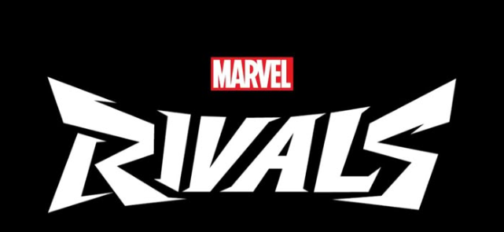
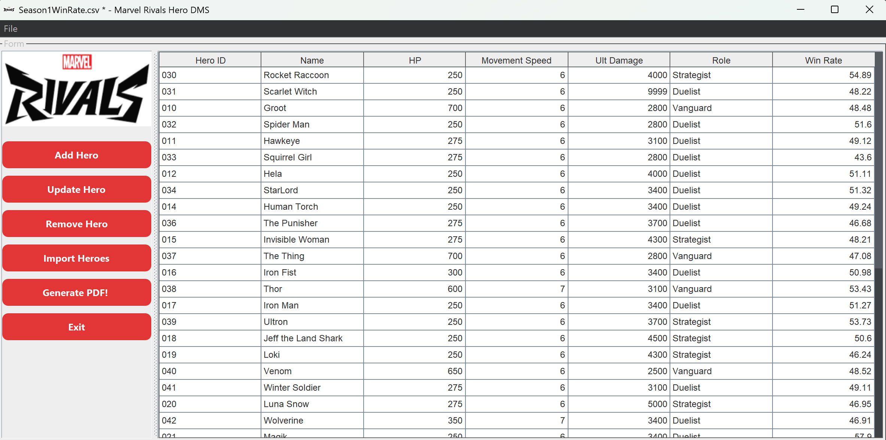

# COP-3330C-Module-9-Phase3
This Repository was created for Software Implementation Phase 3 - Adding a Graphic UI. It includes the .zip file / and the resources that the program uses.

**Name:** Kenji Nakanishi 
**Course:** CEN 3024C Software Development-I 
**CRN:** 14877

**Description of the project: **

Marvel Rivals is a shooting game that is becoming very popular among PC & PS5 gamers. I also enjoy this game so much that I wanted to create a DMS based on this game!

For this phase, no longer console based app is the main portion of the program, now we started to add the GUI with the same performing operations CRUD + custom method.
I have started to learn more about Swing / FlatLaf to create this interface.

The DMS now allows to select a file from the user more interactively and is prone to less error since 
interface did help to easy create a and detect errrors in the program. 

This GUI Marvek Rivals app has the following architecture: 
src/main/java where we have:

main 

**HeroFunctionalities.java** 
handling logic & PDF creating
**FileHeroRepository.java** 
Import and export management 

ui 

**MainFrame.java** 
Where all the interface is programmed for the GUI! 
Used Marvel Rivals colours reference 
**GradientButtonUI.java** 

This is an example of the GUI where the user can import a csv file,
We can see the user loaded a hero season 1 file where the records has been passed through all the fields! 

**Tools used:**
- Java language
- IDE: JetBrain IntelliJ IDE
- Libraries: FlatLaf 3.5
- iTextPDF 5.5
- Maven
- Canva
  
  
